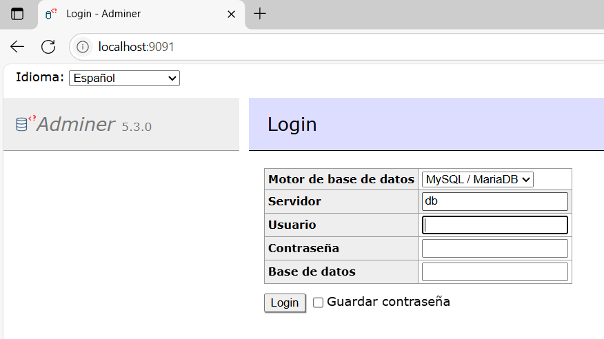

# Proyecto WebIC con Docker

Este proyecto utiliza Docker y Docker Compose para facilitar la configuración y ejecución del entorno de desarrollo.

## Requisitos

- Docker
- Docker Compose

## Instrucciones para levantar el proyecto

1. Abre una terminal y ubícate en la carpeta del proyecto donde está el archivo `docker-compose.yml`.

2. Ejecuta los siguientes comandos:

```bash
docker-compose down
docker-compose up --build -d
```

- `docker-compose down`: detiene y elimina contenedores existentes.
- `docker-compose up --build -d`: construye (si es necesario) y levanta los contenedores en segundo plano.

---

## Acceso al sistema

### Aplicación Web

- URL: [http://localhost:9090/](http://localhost:9090/)

#### Credenciales

**Médico:**
- Usuario: `jimmy_saurux`
- Contraseña: `hola`

**Paciente:**
- Usuario: `matiax2008`
- Contraseña: `hola`

---

## Acceso al gestor de base de datos (Adminer)

- URL: [http://localhost:9091/](http://localhost:9091/)

#### Datos de conexión

- **Servidor:** `diagnomind-db`
- **Usuario:** `diagnoadmin`
- **Contraseña:** `claveultrasecreta`
- **Base de datos:** `diagnomind`

Una vez dentro de Adminer, puedes importar el archivo `sistema_experto.sql` para cargar la estructura y datos de la base de datos.

---



> Si no ves la imagen, asegúrate de que el archivo `adminer-preview.png` esté en la carpeta `doc/` del proyecto.

---

## Tips

- Si realizas cambios en el código fuente y quieres que se reflejen sin reconstruir todo, puedes usar:

```bash
docker-compose restart
```